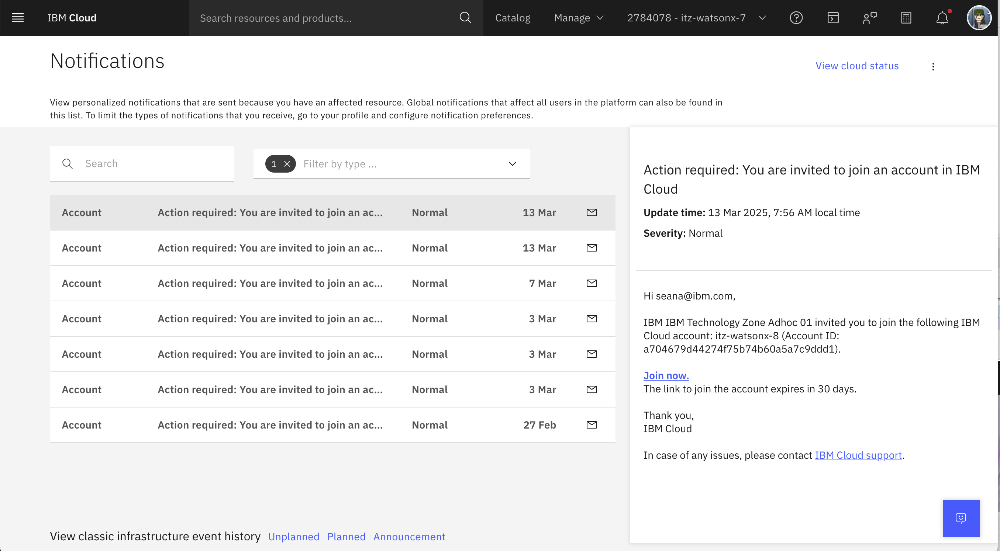

# 🌎 Environment setup

## Instructor Setup

Instructors can [follow these steps](./instructor/README.md) to reserve and configure the environment to run an AI Governance bootcamp.  Once this is done, you can inform the attendees to follow the client setup steps below...

## Client Setup
   
 1. Before your bootcamp, your instructor will set up an IBM Cloud environment with all the tools yo will need. Then, they will invite you to such environment.
    You'll receive an email from IBM Cloud (no-reply@cloud.ibm.com) inviting you to join the corresponding account. Look for the link **Join Now** in the email,
    (highlighted in the screenshot below.) 
      
   
     

**Option:** If you miss the email or don't receive it for any reason! 

You can find the invitation on your IBM Cloud account:
[https://cloud.ibm.com/notifications?type=account](https://cloud.ibm.com/notifications?type=account)

Please select the **Join Now** link. 

   
2. Proceed to watsonx by going to [this link](https://dataplatform.cloud.ibm.com/wx/home?context=wx)
3. Make sure you select the right IBM Cloud account if you have multiple ones. Check with your instructor to make sure you have the correct account 

5. Create a project using your name for the labs.  For example, ***Jane Doe Governance***.  This will allow students to have their own projects to experiment in. 

6. You are now ready to [begin your labs](../labs/monitoring-and-guardrails/README.md)!
