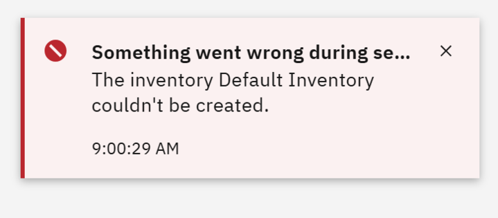

# Configuring Inventories

If you try to create a default inventory and get an error message like this:

then follow the steps below to setup the default inventory:

1. Go to the AI Governance Inventories page - open the menu from the top left and pick **Inventories**

  

You will see the ***Complete setup*** button (which failed previously). 

> [!NOTE]  
> Do not click on the **Complete setup** button yet.  We are going to change the context in the browser and try the setup that way. 

Go to the broswer location bar and change the URL to change the context from ***wx*** to ***cpdaas***. 

Now click on the **Complete Setup** button

and choose the COS from the drop down, and click **Create** to complete the setup.

You may see some warnings/errors about migrating the inventory, but you should see the default inventory created.

Now you can switch the context back to watsonx by clicking on the context button on the top right and then picking ***IBM watsonx***

