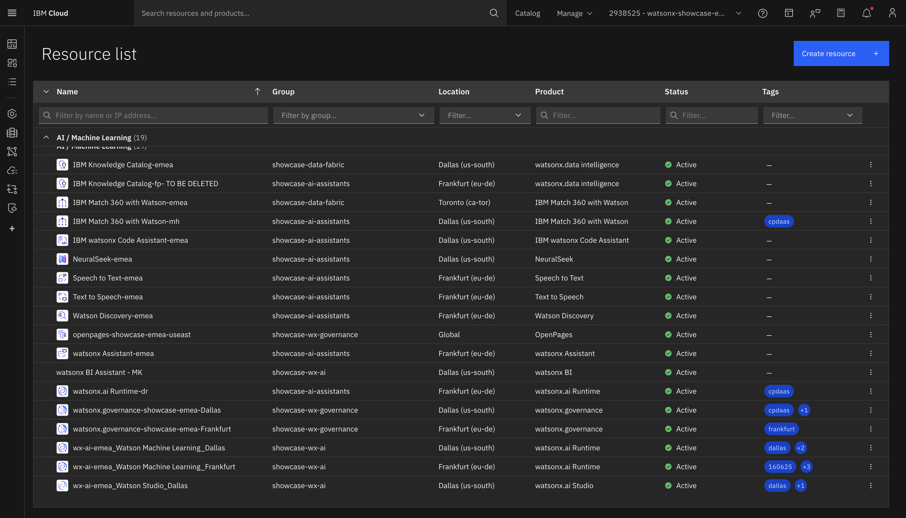
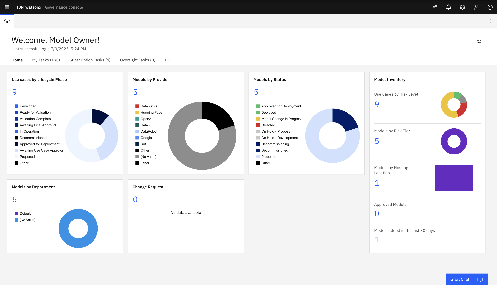

# 🧑‍💼 Lab: Managing AI Risk and Compliance with watsonx.governance 

## 📌 Use Case Description

This lab simulates a governance workflow for a conversational HR agent — **AskHR** — powered by Agentic AI. The focus is on ensuring responsible AI usage through risk identification, review, and approval in **watsonx.governance**.

Your team will assume different roles to:

* Define the business and use case
* Submit and assess risks
* Approve or reject risks based on compliance and strategic alignment

---

## 🏗️ Architecture Overview

---

## ⚙️ Pre-requisites

* Access credentials (provided by the instructor)
* IBM Cloud login with assigned stakeholder role
* Services: IBM OpenPages, Watsonx
* Instructor access to orchestration scripts

---

## 🚀 Getting Started

1. Login to [IBM Cloud](https://cloud.ibm.com)
2. Navigate to **Resource List > AI / Machine Learning**
3. Launch the **OpenPages** instance from the list

> 

---

## 👥 Personas

In this lab you will play different roles in an organization to ensure AI Governance, including: 

1. Use case owner
2. Risk Compliance Officer
3. Business Unit Leader
4. Model Developer
5. Model Validator

> 🔐 **Note:** Make sure you're logged in as the appropriate role before proceeding with assigned tasks.

## 👩‍💼 UseCase Owner Responsibilities

As a UseCase Owner, your responsibilities include:

* Creating the business and child entity
* Defining the use case (AskHR - Agentic AI)
* Submitting associated risks for approval
* Reviews submitted risks and ensures they comply with regulatory and organizational standards.
  
🧭 Steps:

| Step               | Action                        | Status Update                 |
| ------------------ | ----------------------------- | ----------------------------- |
| Risk Received      | Review risk description       | `Awaiting Assessment`         |
| Perform Assessment | (Optional) Add documentation  | `Awaiting Approval`           |
| Finalize Decision  | Approve / Mark Not Applicable | `Approved` / `Not Applicable` |

🔍 Follow these guides:

* [Create Business Entity](https://github.ibm.com/skol/ai-governance-client-bootcamp/blob/main/labs/risk-and-compliance/assets/tasks/business_entity_creation_model_owner.md)
* [Submit and Define Use Case](https://github.ibm.com/skol/ai-governance-client-bootcamp/blob/main/labs/risk-and-compliance/assets/tasks/usecase_creation_model_owner.md)
* [Review and Assess Risk](https://github.ibm.com/skol/ai-governance-client-bootcamp/blob/main/labs/risk-and-compliance/assets/tasks/risk_review_rco.md)

> 

💡 Don’t forget to fill in the **Risk Level** and **Control Details** before submission.

---

## 👤 Business Unit Leader (BUL) Responsibilities

As a BUL, you play a crucial role in stakeholder endorsement. Your input ensures the use case aligns with business strategy and acceptable risk levels.

> ⚠️ **Note:** You must be logged in as **Business Unit Leader** to access this flow.

✅ Steps to Review:

1. Go to `My Tasks` → `Stakeholder Review`
2. Open the assigned Use Case or Risk
3. Review the risk and RCO assessment
4. Leave comments (if needed)
5. Approve if compliant or reject if misaligned
6. Submit your review

🗂️ Follow this guide:

* [Stakeholder Risk Endorsement](https://github.ibm.com/skol/ai-governance-client-bootcamp/blob/main/labs/risk-and-compliance/assets/tasks/risk_endorsement_BUL.md)

---

## 👨‍💻 Model Developer Responsibilities

As a Model Developer, your responsibilities focus on creating and evaluating Prompts and Agents for generative AI use cases. You will build and test these artifacts in the Prompt Lab and Agent Lab. Upon creation, a Factsheet is automatically generated and linked to Watsonx.governance.

You are responsible for completing any required details in the factsheet and submitting it for governance approval.

**🔐 Note:** Make sure you're logged in as Model Developer to access Prompt and Agent Labs.

🗂️ Reference:

* [Model Developer Tasks and Guidelines](https://github.ibm.com/skol/ai-governance-client-bootcamp/blob/main/labs/risk-and-compliance/assets/tasks/model_developer_tasks.md)

---

## 🔍 Model Validator Responsibilities

As a **Model Validator**, you are responsible for monitoring and validating the AI model’s performance and fairness metrics on the **IBM Watson OpenScale** dashboard. You will review alerts related to fairness, quality, drift, and explanations to ensure the model meets governance standards.

### Key Actions:

* Log in as **Model Validator / AI Engineer**
* Navigate via **Hamburger Menu → Instances → openscale-defaultinstance**
* Open **IBM Watson OpenScale** by clicking **Open** (top right)
* Review model performance metrics for fairness, quality, and drift (focus on triggered alerts and violations; raw scores are not the primary concern)
* Evaluate the model by uploading test data provided by your instructor:

  * Click **Actions → Evaluate now**
  * Upload a CSV file containing input and expected output (ground truth)
  * Wait for evaluation to complete
* Submit feedback or observations for governance reporting

### Notes on Evaluation Dataset:

* Max size: 8 MB
* Record limits: Minimum 10, Maximum 1000
* Dataset provided by instructor

🗂️ For detailed steps, refer to:

* [Model Validator Tasks and Evaluation Guide](https://github.ibm.com/skol/ai-governance-client-bootcamp/blob/main/labs/risk-and-compliance/assets/tasks/model_validator_tasks.md)

---

## 📋 Summary of Stakeholder Actions

| Stakeholder Role            | Key Responsibilities                                              | Reference Guide                                                                                                                                                                                                                                                                                                                                            |
| --------------------------- | ----------------------------------------------------------------- | ---------------------------------------------------------------------------------------------------------------------------------------------------------------------------------------------------------------------------------------------------------------------------------------------------------------------------------------------------------- |
| **Model Owner**             | - Create business entity - Define use case - Submit risk    | - [Create Business Entity](https://github.ibm.com/skol/ai-governance-client-bootcamp/blob/main/labs/risk-and-compliance/assets/tasks/business_entity_creation_model_owner.md) - [Submit and Define Use Case](https://github.ibm.com/skol/ai-governance-client-bootcamp/blob/main/labs/risk-and-compliance/assets/tasks/usecase_creation_model_owner.md) |
| **Risk Compliance Officer** | - Review and assess risk for compliance                           | - [Review and Assess Risk](https://github.ibm.com/skol/ai-governance-client-bootcamp/blob/main/labs/risk-and-compliance/assets/tasks/risk_review_rco.md)                                                                                                                                                                                                   |
| **Business Unit Leader**    | - Endorse or reject risk based on alignment with strategy         | - [Stakeholder Risk Endorsement](https://github.ibm.com/skol/ai-governance-client-bootcamp/blob/main/labs/risk-and-compliance/assets/tasks/risk_endorsement_BUL.md)                                                                                                                                                                                        |
| **Model Developer**         | - Create and evaluate prompts and agents for GenAI use cases      | - [Model Developer Tasks and Guidelines](https://github.ibm.com/skol/ai-governance-client-bootcamp/blob/main/labs/risk-and-compliance/assets/tasks/model_developer_tasks.md)                                                                                                                                                                               |
| **Model Validator**         | - Validate model performance and fairness via OpenScale dashboard | - [Model Validator Tasks and Evaluation Guide](https://github.ibm.com/skol/ai-governance-client-bootcamp/blob/main/labs/risk-and-compliance/assets/tasks/model_validator_tasks.md)                                                                                                                                                                         |

---

## 🎉 Congratulations!

You've helped ensure this Agentic AI use case adheres to ethical AI practices by:

* Validating risk levels
* Confirming regulatory and internal compliance
* Approving only well-governed use cases
* Ensuring model fairness and quality through continuous validation

> 🛡️ Governance is not a one-time check — it’s a continuous loop of accountability and alignment.

---

