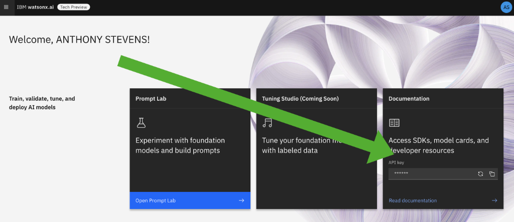

# Desktop Environment Setup

## Introduction

Complete the steps in this guide to ensure your desktop environment has all the required tools and libraries installed.

## Steps to complete

- [1: Connect to watsonx.ai](#1-connect-to-ibm-research-bam)
- [2: Clone the Workshop's Github repo](#2-clone-the-workshops-github-repo)
- [3: Create virtual Python environment (and install required libraries)](#3-create-virtual-python-environment-and-install-jupyter-and-required-libraries)
- [4. Run Jupyter Notebook and Validate All Libraries Installed](#4-run-jupyter-notebook-and-validate-all-libraries-installed)
- [5. Install Visual Studio Code (VS Code)](#5-optional-install-visual-studio-code-vs-code)
- [6: Access watsonx.ai capabilities on BAM](#6-access-watsonxai-capabilites-on-bam)
- [7: Security and .env Files](#7-security-and-env-files)
- [8: .gitignore files](#8-gitignore-files)

### 1: Connect to IBM Research BAM

For most of the labs, you will be using the BAM site as the current GA version of watsonx.ai free plans have a limited number of tokens included in the plan. Verify your connection to the [IBM Research BAM](https://bam.res.ibm.com/) site. If you have a problem accessing, contact the bootcamp coordinator.

### 2: Clone the Workshop's Github repo

If you're a Github pro then you can directly clone this wastonx.ai workshop repo.  Otherwise we recommend downloading and installing the [Github Desktop](https://desktop.github.com/) and then cloning this watsonx.ai workshop repo. Here are instructions on [how to clone a repository using Github Desktop](https://docs.github.com/en/desktop/contributing-and-collaborating-using-github-desktop/adding-and-cloning-repositories/cloning-a-repository-from-github-to-github-desktop). Alternatively, from GUI, Go to base url (https://github.ibm.com/watsonx-ee-squad/ibmc-enablement-labs), Click on Code & Download zip and Extract the zip in your local laptop.


### 3: Create Virtual Python Environment and Install Jupyter and Required Libraries

Python applications import multiple libraries, and oftentimes, conflicts can occur between different versions of required libraries.  However, your app may require a specific library version due to a bug fix.  The solution is to create a virtual environment, a self-contained suite of libraries for a specific Python installation.

To ensure all required Python libraries are installced, [complete these steps to create your virtual Python environment.](create-virtual-python-environment.md)

**NOTE:** Don't skip setting up your Python environment as the documented steps ensure you have installed IBM GenAI Python library, Jupyter Notebook, ChromaDB, Hugging Face and all other required libraries.

Please refer this video link (https://ibm.ent.box.com/s/8qv3afzxr2vd653hsg9fot14wsiym0ym) for windows setup.

If you get this error <b>"ModuleNotFoundError: No module named 'setuptools.command.test'"</b> then follow below steps:<br/>
create a file and name it as constraints.txt (create this file in same dir where you have created venv)<br/>
content of the file should be : setuptools<72<br/>
export PIP_CONSTRAINT=constraints.txt(For windows use set command)<br/>
run pip command again (requirements-venv.txt)<br/>

### 4: Run Jupyter Notebook and Validate All Libraries Installed

You will be executing several Jupyter notebooks during this workshop.  The Jupyter Notebook executable was installed as part of your Virtual Environment setup in [Step #1](create-virtual-python-environment.md).   You will now ensure that you can run Jupyter Notebooks plus validate that all required Python libraries were installed.

Download this [environment test notebook](./environment-test.ipynb) or use the one that your cloned version of this Github repository.  Use the "cd" command to change to the directory holding those notebooks when ready and launch Jupyter as below.

```command
<ensure your python environment is active>
cd <full path to folder containing the environment test notebook>
jupyter notebook
```

Jupyter shoud automatically open a browser window for you. If not (this has been observed with Safari as the default browser), navigate to [http://localhost:8888/notebooks/] to run the notebook. If you see a page that asks for a token authentication, use the `jupyter server list` command to get the full url (with token) to provide.

### 5: [OPTIONAL] Install Visual Studio Code (VS Code)

Most development and data science teams within IBM (and outside) have selected VS Code as their default coding environment.  You can choose to use an alternate IDE for this Boot Camp (like PyCharm or Eclipse), however the Boot Camp coaches will be less skilled at supporting those IDEs. For architects, developers and data scientists, we recommend installing VS Code so you are on a common platform with most of your IBM colleagues.

Go here to [install VS Code and configure it for your Python environment](vs-code.md)

### 6: Access watsonx.ai capabilites on BAM

Log in to the [IBM Research BAM](https://bam.res.ibm.com/) to retrieve your API Key from the right-side of the home screen.  Save this key as we will be using it during the next step.  

<p align="center">
  
</p>

### 7: Security and .env Files

A guaranteed way to get contacted by IBM's Github security team is to check-in code that contains an access credential for an IBM Cloud service.  To avoid this, store credentials in a .env file, then ensure this .env **is not checked into Github.**  Python provides support for .env files through a library called dotenv that you will encounter during some lessons in this Boot Camp.

Download this [env file](./env), open it in a text editor and add your watsonx.ai API key in the GENAI_KEY field. This is also described on the watsonx.ai page describing the [GenAI python library](https://bam.res.ibm.com/docs/ibm-generative-ai).

Add a period to the downloaded "env" file to it is ".env".  You may get a warning that this will convert this to a hidden file so [learn how to view these hidden files on a Mac](https://www.macworld.com/article/671158/how-to-show-hidden-files-on-a-mac.html) or [how to view hidden files on Windows](https://support.microsoft.com/en-us/windows/view-hidden-files-and-folders-in-windows-97fbc472-c603-9d90-91d0-1166d1d9f4b5).

If you are still having trouble renaming the “env” file to “.env”, type the following commands in your terminal:

```command
cd <path to folder containing your env file>
mv env .env
```

To check that the file was changed to .env, type the following command:

```command
ls -la 
```

### 8: .gitignore Files

Whenever checking code into a Github repo, use .gitignore to exclude files from being checked-in.  If you don't know how to do this, [learn how to add your .env to .gitignore](https://salferrarello.com/add-env-to-gitignore/).
