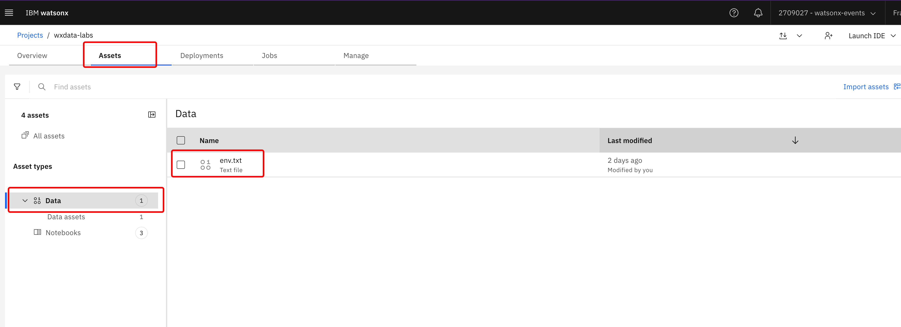
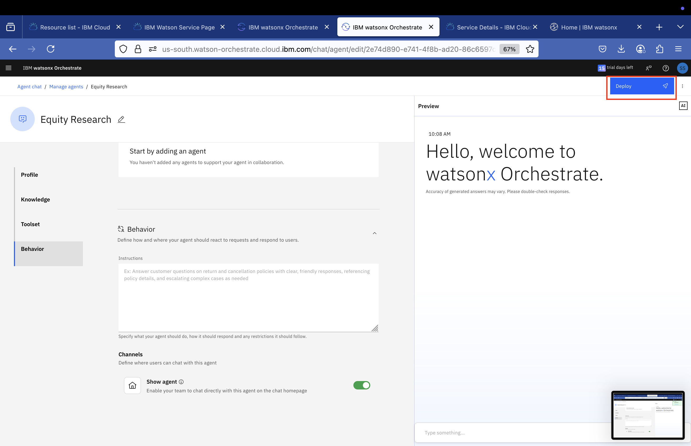
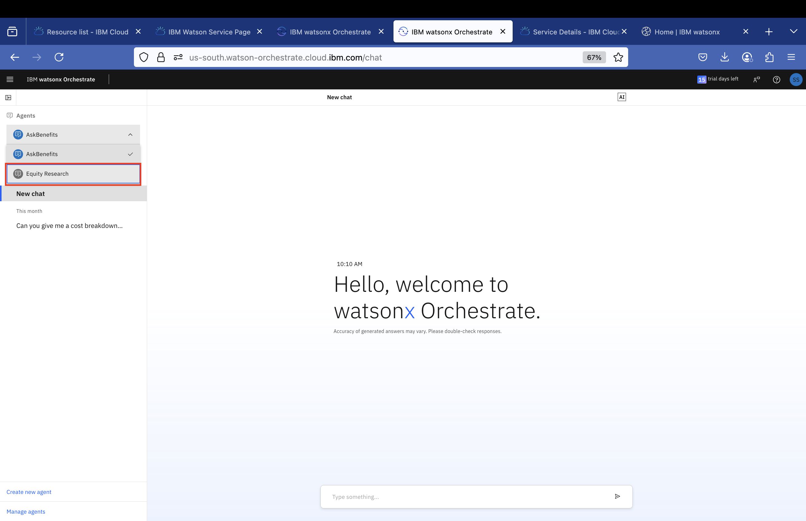

# Agentic RAG Application

- [Agentic RAG Application](#agentic-rag-application)
  - [1. Introduction](#1-introduction)
  - [2.  Prerequisites](#2--prerequisites)
  - [3. Ingest Data into Milvus](#3-ingest-data-into-milvus)
    - [3.1. Open watsonx.ai Project](#31-open-watsonxai-project)
    - [3.2 Import Jupyter Notebook with the script from local folder](#32-import-jupyter-notebook-with-the-script-from-local-folder)
    - [3.3 Open and run the Jupyter Notebook](#33-open-and-run-the-jupyter-notebook)
  - [4. Integrate agent into watsonx Orchestrate](#4-integrate-agent-into-watsonx-orchestrate)
  - [5. Chat with the deployed Agent](#5-chat-with-the-deployed-agent)


## 1. Introduction
This lab implements an Agentic RAG pipeline using watsonx.data Milvus vector database, and watsonx Orchestrate as the user interface for interacting with the agent. 

The application uses:
- **watsonx.data Milvus**: For vector database storage and similarity search
- **LangChain**: For building the RAG pipeline
- **LangGraph**: For orchestrating the RAG workflow
 
The application leverages data that was uploaded to the <INPUT_BUCKET> in Cloud Object Storage by the instructor.

## 2.  Prerequisites
- Completed  [Environment Setup](/env-setup/README.md)
  
  
## 3. Ingest Data into Milvus

Ingestion will be performed using python `langchain` library with customizable parameters for document loading and splitting. 
In milvus default database you will create a new collection corresponding to the pre-defined `MV_COLLECTION_NAME`, collection schema is defined in code:

It contains five fields:
* `id` that will be auto-generated;
* `text_embedding` will contain vectors of embedded chunks;
* `title` of the document;
* `page` where corresponding text chunk is located;
* `text` full chunk of text to be embedded.

Embedding model is specified in `SENTENCE_TRANSFORMER` env variable and will be available from HuggingFace using `HuggingFaceEmbeddings` from langchain.

After performing text embeddings, we insert data into collection and create index to perform vector search. Currently, parameters of vector-search are pre-defined in the code:


Then we load vectors into memory and test semantic search locally.
  
### 3.1. Open watsonx.ai Project
1. Open watsonx.ai Studio Service - From [Cloud Resource list](https://cloud.ibm.com/resources) select `AI / Machine Learning` resources -> `watsonx.ai Studio` service -> open in `IBM watsonx`
<br>
2. Login and from the quick access page -> `Recent work` Select the project you created during [Environment Setup](..//env-setup/README.md).

3. Check that you can see env.txt file in the list of all assets on `Assets` tab

4. Check that Connections are available, we will be using them in the lab


### 3.2 Import Jupyter Notebook with the script from local folder

1. Go to project Assets, select `New asset +`:
  [new-asset](attachments/2025-06-11-13-32-03-pasted-vscode.png)

2. Select `Work with data and models in Python or R notebooks` asset type


3. Import Jupyter Notebook from local file:


4. Select [1_add_data_milvus_collection_wxai.ipynb](1_add_data_milvus_collection_wxai.ipynb)

5. Append name with your initials: `-name-first3lettersSurname` and click `Create`
  

### 3.3 Open and run the Jupyter Notebook

1. It should open automatically right after creation, if not then from `Your Project` -> `Assets`:
    * click on the Jupyter Notebook
    * and then click on pencil to Edit, it will open Jupyter Notebook in edit mode
     

2. Trust Jupyter Notebook in the right upper corner:
  
3. Add a Project Token to reach assets from the Project

     * Click on the second cell with import so it's active
     * Insert cell below by clicking on `+` sign
    
     * From the upper menu select 3 dots sign to insert a project token snippet:
    
     * So now it should look like this (sequence is important):
    
4. Run all cells consequtively starting from packages installations in the first cell and check outputs

## 4. Integrate agent into watsonx Orchestrate

1. Launch `watsonx Orchestrate` from cloud resources: https://cloud.ibm.com/resources

   

2. From the Hamburger menu on the top left go to `Build`, `Agent Builder` 
3. From the manage agents screen click `Create Agent`
   * Choose `Create from Scratch`
   * Name the agent,`Equity Research -{your name}`
   * Under `Profile`, `Description`, paste the text below.  
     ```
     An agent to help researching the Equity market based on the past, and current market performance.  This agent will also provide insights into the emerging trends.   By analyzing market research documents details, the agent answers questions about equity market trends.  If the answer to the question is not contained in your knowledge base, instead of responding you should initiate a transfer to the supervisor agent, copying the users query verbatim.
     ```
   * Click `Create`
   * Select `Choose Knowledge`, `Milvus`, `Next`
   * Add
add host, port, ibmlhapi key and backend cloud api key, next


   * Provide the Milvus connection credentials

     * For GRPC Host - use `MILVUS_HOST` from milvus.json
     * For GRPC Port - use `MILVUS_PORT` from milvus.json
     * For Authentication Type - choose `Basic Authentication`
     * For `Username`, enter `ibmlhapikey`
     * For `Password`, use `watsonx.data Cloud API Key` provided by the instructor.  (Do not use your own Cloud API Key)
     * Click `Next`

   * Provide the Milvus Configuration details

     * For `Database`, enter `default`
     * For `Collection or Alias`, choose `Collection`
     * For `Collection`, enter your `MV_COLLECTION_NAME` from env.txt, example, `equity_research_YourName_First3LettersOfSurname`
     * For `Index` enter `text_embedding`
     * For `embedding_model_id`, select `all-minilm-l6-v2`
     * For `Title`, enter `title`
     * For `Body`, enter `body`
     * Click `Save`

    * Under `Knowledge` ,`Description`, paste the text below.  

     ```
     These  knowledge file had the details of the Equity market and can be used to answer questions to users.   Contains information about market trends and insights for the past and current performance.  If the answer to the question is not contained in your knowledge base, instead of responding you should initiate a transfer to the supervisor agent, copying the users query verbatim.
     ```

     * Under `Behavior` section, **ensure** Chat with Documents is enabled .<br>
      

1. Deploy the agent by clicking the `Deploy` button on the top right 
<br>

## 5. Chat with the deployed Agent

  1. Click the Hamburger menu on the top left and choose Chat
  2. Select the agent you want the chat with, e.g., Equity Research
   

  3. Test the agent by asking questions related to the Equity Research documents.  Here are some sample questions :<br>

      ```What are the main insights from the equity market in 2024?```<br>
      ```Which commodity has the highest percentage change in 2024?```<br>
      ```What is an ETF?```<br>

  4. Evaluate the responses, reasoning and document sources 

      
      


