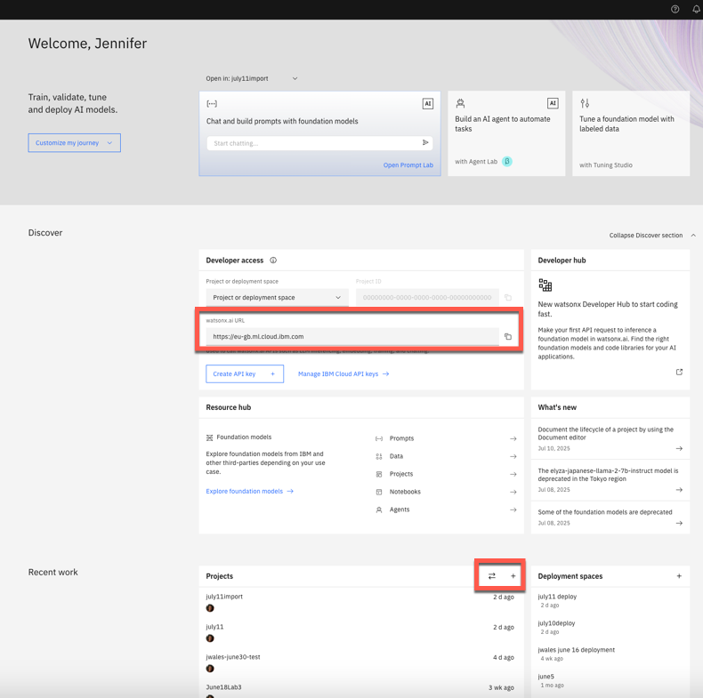
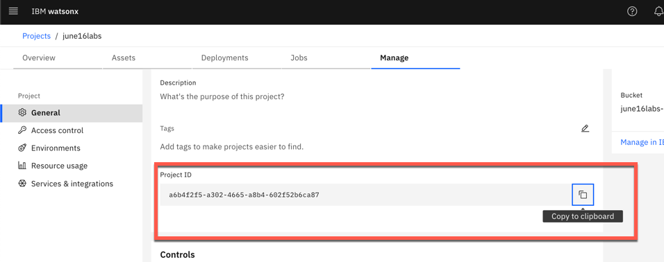
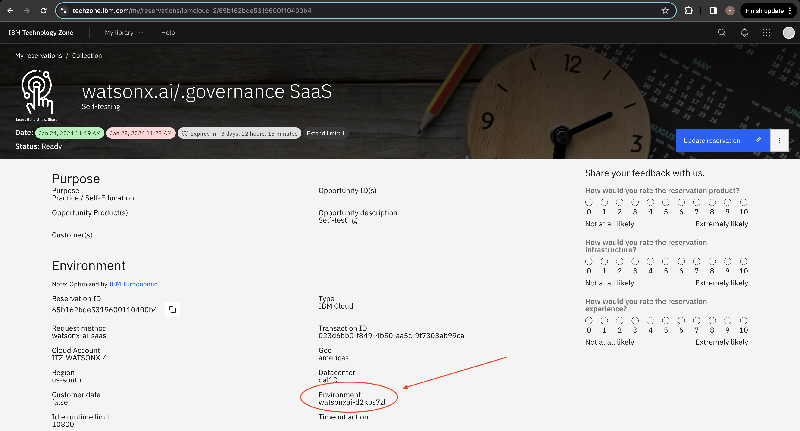
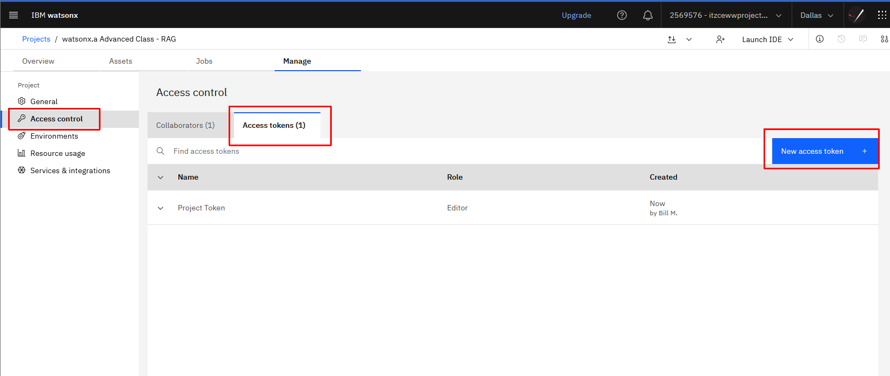
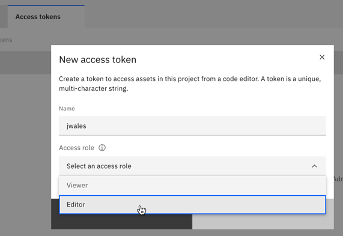
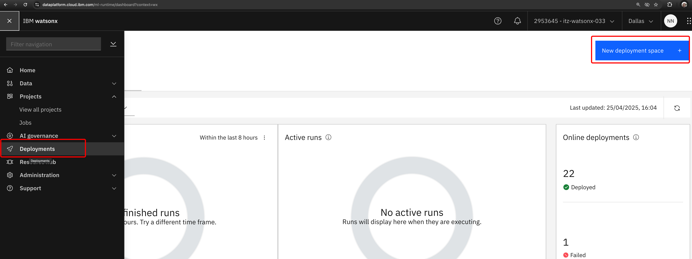
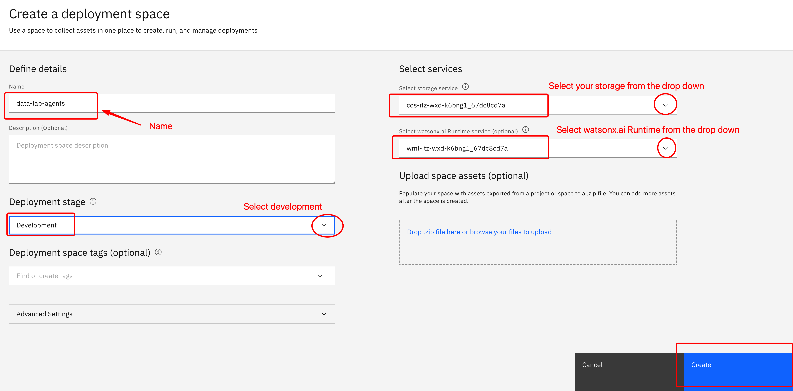
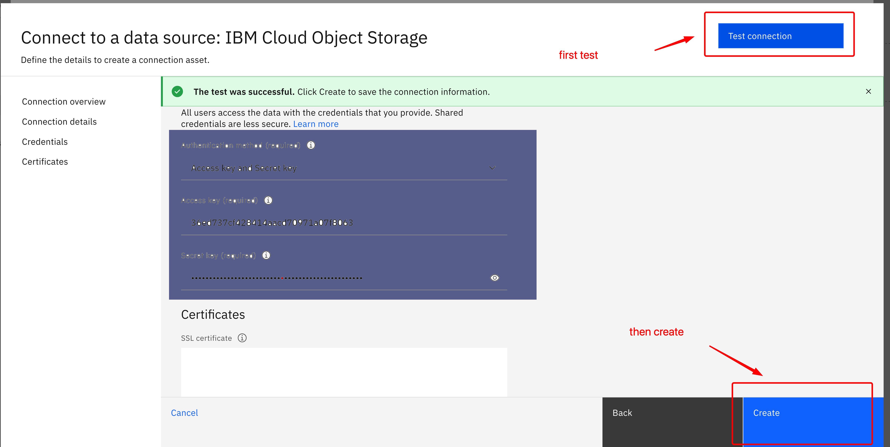
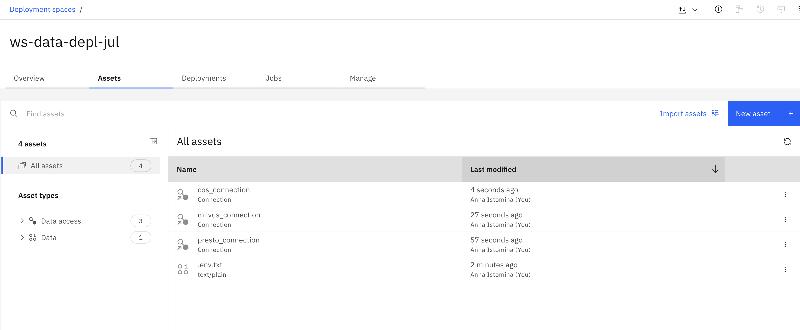

#  Environment Setup

- [Environment Setup](#environment-setup)
  - [1. Getting Started](#1-getting-started)
    - [1.1 Download the Classroom Repo](#11-download-the-classroom-repo)
    - [1.2 Access the bootcamp environment](#12-access-the-bootcamp-environment)
    - [1.3 Open your Techzone Reservation](#13-open-your-techzone-reservation)
    - [1.4 Login to your individual Techzone environment](#14-login-to-your-individual-techzone-environment)
    - [1.5 Verify you are in the right instance.](#15-verify-you-are-in-the-right-instance)
    - [1.6 Open a Text Editor of your choice](#16-open-a-text-editor-of-your-choice)
  - [2. Configuring the Environment](#2-configuring-the-environment)
    - [2.1 Create an API key](#21-create-an-api-key)
    - [2.2 Create a new project](#22-create-a-new-project)
    - [2.3 Associate a watsonx.ai Runtime instance](#23-associate-a-watsonxai-runtime-instance)
    - [2.4 Create a project token](#24-create-a-project-token)
    - [2.5 Create a User API Key](#25-create-a-user-api-key)
    - [2.6 Create deployment space](#26-create-deployment-space)
    - [2.7 Prepare env.txt](#27-prepare-envtxt)
    - [2.8 Upload env.txt to the watsonx.ai Studio project](#28-upload-envtxt-to-the-watsonxai-studio-project)
  - [3. Create Data Source Connections in the watsonx.ai Studio project](#3-create-data-source-connections-in-the-watsonxai-studio-project)
    - [3.1 Add Presto Connection](#31-add-presto-connection)
    - [3.2 Add milvus connection](#32-add-milvus-connection)
    - [3.3 Add COS connection](#33-add-cos-connection)
    - [3.4 Review connections in the project](#34-review-connections-in-the-project)


## 1. Getting Started

### 1.1 Download the Classroom Repo 

- Students will be provided with a zip file of the classroom Repo by the instructor with instructions and files needed for the Bootcamp.


### 1.2 Access the bootcamp environment

For completing this bootcamp you will need access the following services.
* watsonx.data (Shared back-end Environment)
* Cloud Object Storage (COS) 
* watsonx.data Intelligence
* watsonx.ai Studio & Runtime
* watsonx Orchestrate
  
Two techzone environments are needed for the labs.  A shared watsonx.data back-end environment used by all students and an individual labs environment where you will work.

To access the environments, look for email messages from IBM Technology Zone <noreply@techzone.ibm.com> inviting you to join the accounts where your environments are located.  

In each email, Click on the `HERE` link to accept the invitation
(Highlighted in the screenshot below.)


Option: If you miss the email or don't receive it for any reason, you
can find the invitation on your IBM Cloud account:
<https://cloud.ibm.com/notifications?type=account>

Please select the **Join Now** link.


*You might have earlier worked with the same Techzone account / have access to it and you are able to see it in the list of your accounts in IBM Cloud. In that case, select it and check the list of available services for the current reservtion (based on the Group ID and Environment id in Techzone).*


### 1.3 Open your Techzone Reservation 

* Go to your techzone reservation list:
<https://techzone.ibm.com/my/reservations>

* Look for your recently created reservation and click "Open this
environment".

* Scroll down and look for the name of the Cloud Account (will be provided by instructor)


### 1.4 Login to your individual Techzone environment 

* Go to: <https://cloud.ibm.com/resources>

* Login with your IBM credentials

### 1.5 Verify you are in the right instance. 

Check at the top right that you are in the right instance –
**itz-watsonx-event-xxx** 

If it does not show the right name of the instance, you can select it from the drop-down.

<font color="red">**CAUTION:**</font>  The instance at the top right tends to change to your default personal account every time you switch/go back to a new page. Thus, it's always good to check the top right corner **every time** you switch to a new page.

### 1.6 Open a Text Editor of your choice 

Open a text-based notepad to use as a ready reference for the lab.  The labs will have call outs to copy information that will be needed for future configuration steps.

Examples: Notepad on Windows, TextEdit on Mac or use `.txt` file in VSCode.  
 

## 2. Configuring the Environment

### 2.1 Create an API key

From the IBM Cloud interface use the top menu

* Manage -> Access IAM 
* From the Left Navigation click Manage Identities -> API Keys
* Click on the Create button
* Name you key **lab-api-key** and click Create with the defaults
* Copy the key to your text Reference (you will use in a future step)
* Download the file to your laptop / desktop.


1. Log in to watsonx <a name="log-in-to-watsonx"></a>
---
Go to `IBM Cloud` -> `Resource list` -> In `AI/ Machine Learning` resources find `watsonx.ai Studio` instance and click on it -> Launch in IBM watsonx


2. Check that you are in the right account and location <a name="check-instance"></a>
---
You should now be taken to the watsonx home screen. Check at the top right that you are in the right account and location (specified for your Labs account). If it does not show the right name of the account, you can select it in the dropdown. 

If you do not know your account, go to your techzone reservations list https://techzone.ibm.com/my/reservations. Look for your recently created reservation and click on "Open this environment". Scroll down and look for a reservation name that looks similar to this:  `2709027 - watsonx-events`. 

**Note:** The account at the top right tends to change to your default personal account every time you switch/go back to a new page. Thus, it's always good to check the top right corner every time you switch to a new page.


### 2.2 Create a new project<a name="new-project"></a>

1. On the homepage, capture the `watsonx.ai URL` and save to your text based reference, you will need this for your env.txt file.
2. Go to the **Projects** section at the bottom, and click the "+" symbol next to it to create a new project.

    

3. Enter a **unique name** for your project, include both your first and last name and any other information you would like.

    

    **Cloud Object Storage (COS)**
    It is likely there is also already a Cloud Object Storage instance selected for you, with a name that starts with "itzcos-..." If so, you don't have to do anything! 

    Otherwise you may be prompted to select from multiple instances. Please consult with your bootcamp lead which COS instance to select.

    

4. Click Create to create the project. It may take a few seconds to officially be created.

5. Copy the `Project ID` to your text reference, you will need it for your Env file:


1. Return to the watsonx.ai Studio homepage 


### 2.3 Associate a watsonx.ai Runtime instance<a name="wml-instance"></a>
---
1.  Go to the `Manage` tab
2.  Click on `Services and Integrations` in the left side-bar.  
3.  Click on `Associate service`


4. Select the service listed with "Type" = `watsonx.ai Runtime` and click **Associate**. 


**Note:** If you can't find the service, remove all filters from the "Locations" and "Resource Groups" dropdown. If you see 2+ watsonx.ai Runtime services, select the one where "Group" = the same *environment* name of the instance. The *environment* name can be found on https://techzone.ibm.com/my/reservations. 



### 2.4 Create a project token 

The Project token will be used by the notebook for accessing the assets in the project programatically. 

1. Go to the `Manage` tab
2. Under `Access Control` click on the `Access tokens` tab 
3. If you do not have a token, create one by selecting `New access token`
  
4. Give it a name, select `Editor` for `Access Role` and select `Create`  
   

### 2.5 Create a User API Key 

The User API Key is a prerequisite for successful remote deployment and accessing deployments from other services (e.g. watsonx Orchestrate). This key is different from the Cloud API key you previously created.  If you have one already, you are all set.  If you do not, follow the steps below to create it.

1. Go to `Profile and settings` for a given user (upper right corner with user initials) -> `User API Key` Tab:


1. Click `Create a key +` if you do not have one.

### 2.6 Create deployment space
---
1.  In the watsonx.ai Studio Hamburger menu, go to `Deployments` -> `New deployment space +`


2. Fill in `Name`, select `Development` Deployment Stage, select storage service from drop down as well as watsonx.ai Runtime, then click Create


3. Wait till created, then click `View new space`
  

4. From `Manage` tab copy `Space GUID` to the reference note as Deployment space id


### 2.7 Prepare env.txt

1. Copy the template [env.example](../env.example) in the root folder with the name env.txt and open it in any text editor of your choice.

    ```
    cp "./env.example" "./.env.txt"
    ```

1. Update env.txt as follows
    ```
    # Spark Engine ID  -> Update with Engine ID provided by instructor
    SPARK_ENGINE_ID=""

    # cloud user id / Update with your IBMID, usually your email  
    CLOUD_USER_ID = ""

    # COS buckets -> Update with COS buckets provided by instructor
    HIVE_BUCKET=""
    WXD_BUCKET=""
    MILVUS_BUCKET=""
    INPUT_BUCKET=""

    # watsonx data catalogs -> Should not need to change unless provided by instructor
    HIVE_CATALOG="hive_catalog"
    ICEBERG_CATALOG="iceberg_data"


    # watsonx.data schemas -> Update schemas names to add your name and first 3 letter from surname
    SCHEMA_DWH_OFFLOAD = "netezza_offload_YourName_First3LettersOfSurname"
    SCHEMA_DATA_H = "input_data_hive_YourName_First3LettersOfSurname"
    SCHEMA_DATA_I = "clients_schema_YourName_First3LettersOfSurname"

    # From watsonx.ai studio->  Copy from your Reference Note
    WATSONX_URL = "watsonx.ai URL"
    WATSONX_PROJECT_ID = "watsonx.ai Project ID"
    WATSONX_DEPLOYMENT_SPACE_ID = "Deployment space GUID"

    # milvus ingestion parameters ->> Update collection name to add your name and first 3 letter from surname
    MV_COLLECTION_NAME="equity_research_YourName_First3LettersOfSurname"

    # COS folder with input pdf files for milvus ingestion -> should not need to change unless provided by instructor
    COS_FOLDER = "pdfs"

    # parameters for milvus ingestion -> should not need to change unless provided by instructor
    SIMILARITY_METRIC="L2"
    SENTENCE_TRANSFORMER = "sentence-transformers/all-minilm-l6-v2"
    TEXT_SPLITTER_CHUNK_SIZE=1000
    TEXT_SPLITTER_CHUNK_OVERLAP=200
    TEXT_SPLITTER_SEPARATORS='[" \n", "\n"]'
    TEXT_REPLACEMENTS='{"✔": "ok"}'
    TEXT_SPLITTER_TYPE="RecursiveCharacterTextSplitter" 
  
### 2.8 Upload env.txt to the watsonx.ai Studio project
:warning: Make sure you have all values filled in `env.txt` before uploading it to your project.
> This file contains all the necessary configuration that will be uploaded into your kernel as environmental variables.  

* Go to your Project in watsonx.ai by selecting the Hamburger menu -> Projects -> YourProject
* Go to the `Assets` tab
* Click on numbers in the right upper corner to upload data files
  

* Drag and drop your `env.txt` file to the dedicated area
* Check that you can see this file in the list of all assets on `Assets` tab
  


## 3. Create Data Source Connections in the watsonx.ai Studio project
### 3.1 Add Presto Connection
From watsonx.ai Studio Project -> `Assets` -> `New asset +` -> `Connect to a data source` -> Search for `IBM watsonx.data` -> Select `Presto` -> `Next`


**Fill in your connection details**:  
The easiest way will be to fill in connection details from JSON snippet provided by the instructor.

* Select `Enter JSON Snippet`
* Select `Upload File`
* Browse to the `presto.json` provided by the instructor and click `Enter`
 
You should see all connection details entered except for API key, enter it manually:  
* Rename the name of the connection to (required): `presto_connection`
* Paste the `watsonx.data Cloud API Key` provided by the instructor in the `API Key` field (Not the student Cloud API Key)
* `Test connection` (upper right corner)and once successful, `Create` connection. 
  
  **IMPORTANT** :  Use the instructor provided Cloud API Key, not your own Cloud API Key for the Presto connection


### 3.2 Add milvus connection
Repeat the steps and create the Milvus Connection.

From watsonx.ai Studio Project -> `Assets` -> `New asset +` -> `Connect to a data source` -> Search for `IBM watsonx.data` -> Select `Milvus`


**Fill in your connection details**:  
The easiest way will be to fill in connection details from JSON snippet provided by the instructor.

* Select `Enter JSON Snippet`
* Select `Upload File`
* Browse to the `milvus.json` provided by the instructor and click `Enter`
You should see all connection details entered except for Username and Password
* Rename the name of the connection to (required): `milvus_connection`
* Enter the Username as: `ibmlhapikey`
* Paste the `watsonx.data Cloud API Key` provided by the instructor as the password. (Not the student Cloud API Key)
* `Test connection` (upper right corner)and once successful, `Create` connection. 
  
  **IMPORTANT** :  Use the instructor provided Cloud API Key, not your own Cloud API Key for the Milvus connection
* `Test connection` (upper right corner)and once successful, `Create` connection.


### 3.3 Add COS connection
From watsonx.ai Studio Project -> `Assets` -> `New asset +` -> `Connect to a data source` -> Search for `IBM Cloud Object Storage` -> Select `IBM Cloud Object Storage`


Fill in your connection details:
* Name `cos_connection`
* Leave `Bucket` name field empty
* For Login URL, use `COS Bucket Public Endpoint` provided by Instructor without `https://`
* Under Credentials, select `Resource Instance ID and API Key`
* For Resource instance ID, enter `COS CRN` provided by Instructor
* For API key, enter `COS API Key` provided by instructor.  Not Cloud API key(s)

  

* `Test connection` (upper right corner)and once successful, `Create` connection.


### 3.4 Review connections in the project

1. Verify you have 3 connections using the recommended naming conventions (so we can use it in code)
   * cos_connection
   * milvus_connection
   * presto_connection



**Congratulations!  You are ready for the labs.**

Return back to [Labs/README.md](../Labs/README.md)