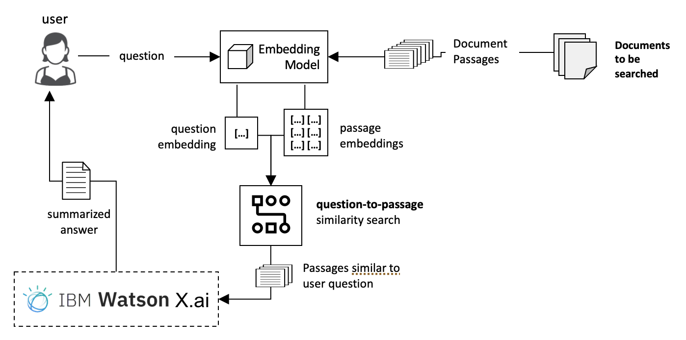

# Lab4: RAG Agent

# Retrieval Augment Generation (RAG) for Contextual and Timely Answers

### Introduction
In this lab, you will apply Retrieval Augment Generation (RAG) to retrieve then summarize text based on user queries.  Here is a high level view of a RAG implementation.  

**Retrieval-Augmented Generation (RAG)** is an AI framework that enhances the accuracy and factual grounding of Large Language Models (LLMs) by connecting them to external, authoritative knowledge sources.  
Instead of relying solely on pre-trained data, RAG retrieves relevant documents or passages in real time and uses them to generate contextually accurate and up-to-date responses.

This approach bridges the gap between static model knowledge and dynamic real-world information, making AI systems more factual, traceable, and domain-aware.

 

        
      

---

## Why RAG is Needed

LLMs, though powerful, are limited by the static nature of their training data. RAG addresses the following issues:

| Limitation | Description | RAG Solution |
|-------------|--------------|--------------|
| Hallucinations | LLMs may produce factually incorrect responses. | Grounds answers in verifiable documents. |
| Stale Knowledge | Models cannot access post-training information. | Enables retrieval from current data sources. |
| Lack of Domain Knowledge | Models cannot access private or enterprise datasets. | Integrates proprietary or structured knowledge bases. |

---

<h2>RAG Workflow</h2>

     

### 1. Indexing Phase — Preparing the Knowledge Base

| Step | Description | Techniques |
|------|--------------|-------------|
| Data Ingestion | Collect and preprocess documents (PDFs, text, databases). | Document loaders, connectors. |
| Chunking | Divide large documents into smaller, semantically meaningful chunks. | Fixed-size or adaptive chunking. |
| Embedding | Convert text into dense vector representations. | Embedding models (OpenAI, Cohere, Hugging Face). |
| Vector Storage | Store embeddings for similarity search. | FAISS, Pinecone, Weaviate, Chroma. |

---

### 2. Inference Phase — Generating Answers

| Step | Description | Techniques |
|------|--------------|-------------|
| Query Embedding | Represent the query as a vector. | Same embedding model as document embeddings. |
| Retrieval | Find top-k semantically similar chunks. | Vector search, approximate nearest neighbor (ANN). |
| Augmentation | Combine retrieved text with the query. | Context concatenation, prompt templates. |
| Generation | Produce a grounded answer. | GPT-4, Llama, Claude, Mistral, etc. |

**Analogy:**  
The LLM acts like a student who retrieves the most relevant textbook pages before answering a question.

---

<h2>Evolution of RAG Architectures</h2>

### 1. Naive RAG
- Basic retrieval → generation workflow.
- Simple, effective for small-scale Q&A tasks.
- Limited control over retrieval quality.

---

### 2. Advanced RAG

| Phase | Technique | Description |
|--------|------------|-------------|
| Pre-Retrieval | Parent Document Retrieval | Retrieves chunks but passes the full document for better context. |
|  | HyDE (Hypothetical Document Embedding) | Uses LLM-generated hypothetical answers to improve search vectors. |
| Retrieval Refinement | Hybrid Search | Combines dense (semantic) and sparse (keyword) retrieval. |
|  | Query Transformation | Reformulates queries for better recall. |
| Post-Retrieval | Re-ranking | Scores retrieved passages using a cross-encoder model. |
|  | Context Compression | Reduces redundancy and irrelevant context. |

---

### 3. Modular and Agentic RAG

| Type | Description | Capabilities |
|------|--------------|---------------|
| Modular RAG | Treats retrieval, augmentation, and generation as pluggable modules. | Enables routing and system-level optimization. |
| Agentic RAG | LLM plans retrievals dynamically, critiques results, and iterates. | Supports reasoning and multi-step tool use. |
| Graph RAG | Uses entity and relationship graphs for multi-hop reasoning. | Improves logical consistency and factual depth. |
| Multi-Modal RAG | Integrates multiple content types (text, image, audio). | Enables richer contextual understanding. |

---

<h2>Evaluation and RAG Operations (RAG-Ops)</h2>

### Evaluation Metrics

| Category | Metric | Purpose |
|-----------|---------|---------|
| Retrieval | Recall@k, Precision | Measures if relevant documents were retrieved. |
| Generation | Faithfulness, Relevance | Checks factual alignment with retrieved data. |
| Human Evaluation | Accuracy, Readability | Assesses user-perceived quality. |

**Tools:**  
- RAGAS (ExplodingGradients)  
- DeepEval  
- LLM-as-a-Judge evaluation frameworks

### Operationalization (RAG-Ops)
- Log retrieved chunks, ranks, and sources per query.  
- Automate regression testing for performance drift.  
- Maintain observability and traceability for compliance.

---

<h2>RAG vs Fine-Tuning vs PEFT</h2>

| Feature | Retrieval-Augmented Generation (RAG) | Fine-Tuning (Full) | Parameter-Efficient Fine-Tuning (PEFT) |
|----------|--------------------------------------|--------------------|----------------------------------------|
| **Goal** | Augment the LLM with external, up-to-date knowledge at inference time. | Adapt the LLM's internal knowledge and behavior to a specific domain or task. | Achieve the benefits of fine-tuning with significantly less compute and memory. |
| **Mechanism** | The model retrieves relevant documents from a knowledge base (often a vector store) and uses them as context in the prompt to generate an answer. | All model parameters/weights are updated using a task-specific, labeled dataset. | Only a small subset of new parameters (or "adapters") are trained and added to the pre-trained model, which remains mostly frozen. |
| **Knowledge** | Dynamic (easily updated by changing the knowledge base). | Static (the model's knowledge is a "snapshot" of the training data and requires full retraining for updates). | Static (similar to full fine-tuning, but easier to update/swap adapters). |
| **Resource Cost** | Lower (No model retraining required; primary cost is data processing, storage, and retrieval latency). | Highest (Requires significant GPU power, time, and large datasets for training). | Low to Moderate (Much cheaper and faster than full fine-tuning; can often be done on consumer GPUs). |
| **Best For** | Factual Q&A over constantly evolving or proprietary data (e.g., customer support, internal documents, real-time news). | Teaching new, specific skills or deeply specializing the model's style, tone, or format (e.g., medical transcription, legal summary). | Domain adaptation or task specialization when budget/hardware is limited (e.g., LoRA, QLoRA). |
| **Transparency** | High (Responses are grounded in retrieved source documents, making it auditable and reducing hallucinations). | Low ("Black box" knowledge; reasoning is opaque). | Low (Like full fine-tuning, but with a modular adaptation). |

---

<h2>Popular Frameworks and Tools</h2>

| Framework | Focus Area | Key Features | Ideal Use Case |
|------------|-------------|---------------|----------------|
| LangChain | Workflow orchestration | Chains, agents, and tools. | Multi-step conversational systems. |
| LlamaIndex | Data indexing and retrieval | Multiple index types and connectors. | Document-heavy workloads. |
| Haystack | Production pipelines | Directed graph execution. | Enterprise-scale RAG systems. |
| DSPy | Declarative LLM programming | Automated prompt optimization. | Self-improving AI systems. |

---

### RAG Agent : Getting Started

This lab implements an Agentic RAG pipeline using watsonx.data Milvus vector database, and watsonx Orchestrate as the user interface for interacting with the agent. 

Follow the steps in the [Agentic RAG Guide](Agentic_RAG_Guide.md) to create the RAG agent.

